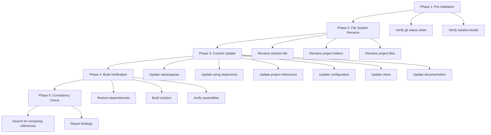
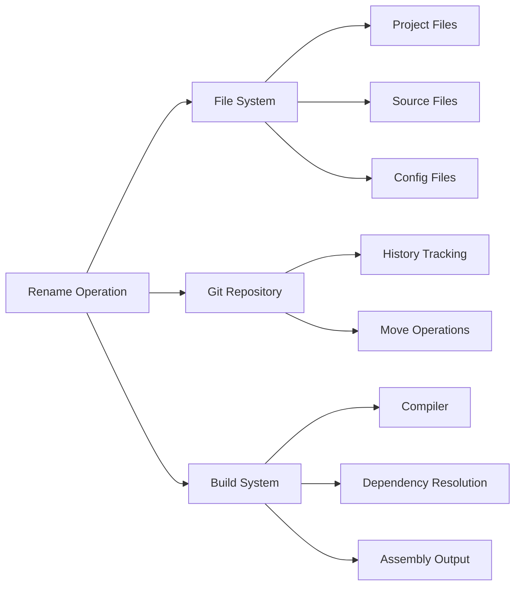

# Design Document: Rename Project to VibeMusic

## Overview

This design document specifies the technical approach for renaming the YoutubeMusicPlayer project to VibeMusic. The rename operation is a comprehensive refactoring that affects the entire solution structure while maintaining functional equivalence and preserving git history.

### Scope

The rename operation encompasses:
- Solution file (`.slnx`)
- 5 project folders and their `.csproj` files
- All C# source files (namespaces and using statements)
- Configuration files (JSON)
- View files (Razor `.cshtml`)
- Documentation files (Markdown)
- Git history preservation

### Out of Scope

The following elements are explicitly excluded from the rename:
- Database schema (table names, column names)
- Database connection strings
- External API endpoints or service references
- Business logic implementation
- Data access patterns

### Design Principles

1. **Atomicity**: The rename should be performed as a coordinated set of operations
2. **Traceability**: Git history must be preserved using `git mv` commands
3. **Verification**: Build success is the primary validation criterion
4. **Consistency**: All references must be updated uniformly
5. **Safety**: Database schema remains unchanged to avoid data migration

## Architecture

### Rename Operation Phases

The rename operation follows a sequential execution model with five distinct phases:



### Component Interaction

The rename operation interacts with multiple system components:



## Components and Interfaces

### 1. File System Rename Component

**Responsibility**: Rename folders and files while preserving git history

**Operations**:
- `RenameSolutionFile()`: Rename `.slnx` file
- `RenameProjectFolder(oldPath, newPath)`: Rename project directory
- `RenameProjectFile(oldPath, newPath)`: Rename `.csproj` file

**Git Integration**:
```bash
git mv YoutubeMusicPlayer.slnx VibeMusic.slnx
git mv YoutubeMusicPlayer/ VibeMusic/
git mv YoutubeMusicPlayer.Application/ VibeMusic.Application/
git mv YoutubeMusicPlayer.Domain/ VibeMusic.Domain/
git mv YoutubeMusicPlayer.Infrastructure/ VibeMusic.Infrastructure/
git mv YoutubeMusicPlayer.Tests/ VibeMusic.Tests/
```

**Constraints**:
- Must use `git mv` to preserve history
- Must execute folder renames before file renames
- Must handle nested `.csproj` files within renamed folders

### 2. Content Update Component

**Responsibility**: Update text content within files

**Operations**:
- `UpdateNamespaces(filePath)`: Replace namespace declarations
- `UpdateUsingStatements(filePath)`: Replace using directives
- `UpdateProjectReferences(csprojPath)`: Update `<ProjectReference>` paths
- `UpdateConfiguration(jsonPath)`: Replace references in JSON files
- `UpdateViews(cshtmlPath)`: Replace references in Razor files
- `UpdateDocumentation(mdPath)`: Replace references in Markdown files

**Pattern Matching**:

| Pattern Type | Search Pattern | Replacement Pattern |
|-------------|----------------|---------------------|
| Namespace Declaration | `namespace YoutubeMusicPlayer` | `namespace VibeMusic` |
| Namespace Declaration | `namespace YoutubeMusicPlayer.Application` | `namespace VibeMusic.Application` |
| Namespace Declaration | `namespace YoutubeMusicPlayer.Domain` | `namespace VibeMusic.Domain` |
| Namespace Declaration | `namespace YoutubeMusicPlayer.Infrastructure` | `namespace VibeMusic.Infrastructure` |
| Namespace Declaration | `namespace YoutubeMusicPlayer.Tests` | `namespace VibeMusic.Tests` |
| Using Statement | `using YoutubeMusicPlayer` | `using VibeMusic` |
| Project Reference | `YoutubeMusicPlayer.Application.csproj` | `VibeMusic.Application.csproj` |
| Assembly Name | `<AssemblyName>YoutubeMusicPlayer</AssemblyName>` | `<AssemblyName>VibeMusic</AssemblyName>` |
| Root Namespace | `<RootNamespace>YoutubeMusicPlayer</RootNamespace>` | `<RootNamespace>VibeMusic</RootNamespace>` |

**File Type Handlers**:

1. **C# Files (`.cs`)**:
   - Update namespace declarations
   - Update using statements
   - Preserve all other code unchanged

2. **Project Files (`.csproj`)**:
   - Update `<ProjectReference>` paths
   - Update `<AssemblyName>` elements
   - Update `<RootNamespace>` elements

3. **Configuration Files (`.json`)**:
   - Update string values containing "YoutubeMusicPlayer"
   - Preserve JSON structure and formatting

4. **View Files (`.cshtml`)**:
   - Update `@using` directives
   - Update `@model` directives
   - Preserve HTML and Razor syntax

5. **Documentation Files (`.md`)**:
   - Update text references
   - Preserve markdown formatting

### 3. Build Verification Component

**Responsibility**: Verify solution builds successfully after rename

**Operations**:
- `RestoreDependencies()`: Run `dotnet restore`
- `BuildSolution()`: Run `dotnet build`
- `VerifyAssemblies()`: Check output assemblies exist with correct names

**Expected Assemblies**:
- `VibeMusic.dll`
- `VibeMusic.Application.dll`
- `VibeMusic.Domain.dll`
- `VibeMusic.Infrastructure.dll`
- `VibeMusic.Tests.dll`

**Error Handling**:
- Capture compilation errors
- Report unresolved references
- Identify files with broken dependencies

### 4. Consistency Check Component

**Responsibility**: Verify all references have been updated

**Operations**:
- `SearchSourceFiles()`: Search `.cs` files for "YoutubeMusicPlayer"
- `SearchProjectFiles()`: Search `.csproj` files for "YoutubeMusicPlayer"
- `SearchConfigFiles()`: Search `.json` files for "YoutubeMusicPlayer"
- `SearchViewFiles()`: Search `.cshtml` files for "YoutubeMusicPlayer"
- `ReportFindings()`: Generate report of remaining references

**Search Scope**:
- Include: All project folders
- Exclude: `bin/`, `obj/`, `.git/`, `node_modules/`

## Data Models

### Rename Mapping

The rename operation uses a mapping structure to track old and new names:

```csharp
public class RenameMapping
{
    public string OldName { get; set; }
    public string NewName { get; set; }
    public RenameType Type { get; set; }
}

public enum RenameType
{
    SolutionFile,
    ProjectFolder,
    ProjectFile,
    Namespace,
    Assembly
}
```

### Rename Mappings

```csharp
var mappings = new List<RenameMapping>
{
    // Solution
    new() { OldName = "YoutubeMusicPlayer.slnx", NewName = "VibeMusic.slnx", Type = RenameType.SolutionFile },
    
    // Project Folders
    new() { OldName = "YoutubeMusicPlayer", NewName = "VibeMusic", Type = RenameType.ProjectFolder },
    new() { OldName = "YoutubeMusicPlayer.Application", NewName = "VibeMusic.Application", Type = RenameType.ProjectFolder },
    new() { OldName = "YoutubeMusicPlayer.Domain", NewName = "VibeMusic.Domain", Type = RenameType.ProjectFolder },
    new() { OldName = "YoutubeMusicPlayer.Infrastructure", NewName = "VibeMusic.Infrastructure", Type = RenameType.ProjectFolder },
    new() { OldName = "YoutubeMusicPlayer.Tests", NewName = "VibeMusic.Tests", Type = RenameType.ProjectFolder },
    
    // Project Files
    new() { OldName = "YoutubeMusicPlayer.csproj", NewName = "VibeMusic.csproj", Type = RenameType.ProjectFile },
    new() { OldName = "YoutubeMusicPlayer.Application.csproj", NewName = "VibeMusic.Application.csproj", Type = RenameType.ProjectFile },
    new() { OldName = "YoutubeMusicPlayer.Domain.csproj", NewName = "VibeMusic.Domain.csproj", Type = RenameType.ProjectFile },
    new() { OldName = "YoutubeMusicPlayer.Infrastructure.csproj", NewName = "VibeMusic.Infrastructure.csproj", Type = RenameType.ProjectFile },
    new() { OldName = "YoutubeMusicPlayer.Tests.csproj", NewName = "VibeMusic.Tests.csproj", Type = RenameType.ProjectFile },
    
    // Namespaces
    new() { OldName = "YoutubeMusicPlayer", NewName = "VibeMusic", Type = RenameType.Namespace },
    new() { OldName = "YoutubeMusicPlayer.Application", NewName = "VibeMusic.Application", Type = RenameType.Namespace },
    new() { OldName = "YoutubeMusicPlayer.Domain", NewName = "VibeMusic.Domain", Type = RenameType.Namespace },
    new() { OldName = "YoutubeMusicPlayer.Infrastructure", NewName = "VibeMusic.Infrastructure", Type = RenameType.Namespace },
    new() { OldName = "YoutubeMusicPlayer.Tests", NewName = "VibeMusic.Tests", Type = RenameType.Namespace }
};
```

### Verification Result

```csharp
public class VerificationResult
{
    public bool Success { get; set; }
    public List<string> Errors { get; set; } = new();
    public List<string> Warnings { get; set; } = new();
    public List<RemainingReference> RemainingReferences { get; set; } = new();
}

public class RemainingReference
{
    public string FilePath { get; set; }
    public int LineNumber { get; set; }
    public string LineContent { get; set; }
}
```

## Error Handling

### Pre-Validation Errors

| Error Condition | Detection | Response |
|----------------|-----------|----------|
| Uncommitted changes | `git status` shows modifications | Abort operation, prompt user to commit or stash |
| Build failure | `dotnet build` returns non-zero | Abort operation, report compilation errors |
| Missing projects | Project folders not found | Abort operation, report missing components |

### Rename Operation Errors

| Error Condition | Detection | Response |
|----------------|-----------|----------|
| File system permission denied | OS error during rename | Abort operation, report permission issue |
| Git operation failure | `git mv` returns non-zero | Abort operation, report git error |
| File not found | Target file missing during content update | Skip file, log warning |

### Post-Rename Errors

| Error Condition | Detection | Response |
|----------------|-----------|----------|
| Build failure | `dotnet build` returns non-zero | Report compilation errors with file locations |
| Missing assemblies | Expected `.dll` files not found | Report missing assemblies |
| Remaining references | Search finds "YoutubeMusicPlayer" | Report locations of remaining references |

### Rollback Strategy

If critical errors occur during the rename operation:

1. **Before Git Commit**: Use `git reset --hard` to revert all changes
2. **After Git Commit**: Use `git revert` to create a reverting commit
3. **Manual Intervention**: Provide detailed error report for manual correction

## Testing Strategy

### Why Property-Based Testing Does Not Apply

Property-based testing (PBT) is **not applicable** to this feature because:

1. **One-time operation**: The rename is a singular refactoring task, not a function with varying inputs
2. **Infrastructure work**: File system manipulation and build tooling are not algorithmic logic
3. **No universal properties**: There are no properties that hold across random inputs (the inputs are fixed: specific file names and paths)
4. **Deterministic operation**: The rename has fixed inputs and outputs, not a range of possible values
5. **Similar to IaC**: This is configuration/tooling work, similar to Infrastructure as Code

### Testing Approach

The appropriate testing strategy for this rename operation is:

1. **Example-Based Integration Tests**: Verify specific files and folders are renamed correctly
2. **Smoke Tests**: Verify the solution builds successfully after rename
3. **Manual Verification**: Check git history preservation and functional equivalence

### Pre-Rename Testing

**Objective**: Verify the solution is in a valid state before rename

**Tests**:
1. Verify git working directory is clean
2. Verify solution builds without errors
3. Verify all expected project folders exist
4. Verify all expected project files exist

### Post-Rename Testing

**Objective**: Verify the rename operation completed successfully

**Tests**:

1. **File System Verification** (Example-Based Tests)
   - Verify old solution file does not exist
   - Verify new solution file exists
   - Verify old project folders do not exist
   - Verify new project folders exist
   - Verify old project files do not exist
   - Verify new project files exist

2. **Content Verification** (Example-Based Tests)
   - Verify no namespace declarations contain "YoutubeMusicPlayer"
   - Verify no using statements contain "YoutubeMusicPlayer"
   - Verify no project references contain "YoutubeMusicPlayer"
   - Verify configuration files use "VibeMusic"
   - Verify view files use "VibeMusic"

3. **Build Verification** (Smoke Test)
   - Verify `dotnet restore` succeeds
   - Verify `dotnet build` succeeds
   - Verify output assemblies exist with correct names:
     - `VibeMusic.dll`
     - `VibeMusic.Application.dll`
     - `VibeMusic.Domain.dll`
     - `VibeMusic.Infrastructure.dll`
     - `VibeMusic.Tests.dll`

4. **Git History Verification** (Manual Verification)
   - Verify `git log --follow` shows history for renamed files
   - Verify renamed files are tracked as moves, not deletions + additions

5. **Functional Verification** (Smoke Test)
   - Verify application starts without errors
   - Verify database connection succeeds
   - Verify existing data is accessible
   - Verify core features function correctly

### Test Execution Strategy

**Unit Tests**: Not applicable (this is a refactoring operation, not new functionality)

**Integration Tests**: Example-based tests to verify specific rename operations completed correctly

**Smoke Tests**: Single-execution tests to verify build success and runtime functionality

**Manual Verification**: Developer inspection of git history and functional behavior

**Acceptance Tests**: Execute all acceptance criteria from requirements document

### Test Environment

- Clean git working directory
- .NET 10.0 SDK installed
- PostgreSQL database accessible
- All dependencies restorable via NuGet

## Implementation Notes

### Execution Order

The rename operation must follow this strict order:

1. **Pre-validation** (abort if any check fails)
2. **Rename solution file** (single file operation)
3. **Rename project folders** (5 folder operations)
4. **Rename project files** (5 file operations, already inside renamed folders)
5. **Update content** (all files in parallel)
6. **Build verification** (restore + build)
7. **Consistency check** (search for remaining references)

### Special Considerations

**Migration Files**: Entity Framework migration files contain namespace declarations and should be updated like other C# files. The migration history table in the database is unaffected.

**Configuration Files**: JSON files may contain "YoutubeMusicPlayer" in string values (e.g., logging categories, application names). These should be updated for consistency.

**View Files**: Razor views use `@using` and `@model` directives that reference namespaces. These must be updated to resolve types correctly.

**Documentation**: README.md and other documentation should be updated for consistency, but this is not critical for build success.

**Git History**: Using `git mv` instead of manual rename + delete + add preserves the file history, making it easier to track changes over time with `git log --follow`.

### Performance Considerations

- Content updates can be parallelized across files
- Large files (e.g., migration snapshots) may take longer to process
- Build verification is the slowest step (typically 10-30 seconds)

### Idempotency

The rename operation is **not idempotent**. Running it twice will fail because:
- Source files/folders no longer exist after first execution
- Target files/folders already exist after first execution

To re-run the operation, the repository must be reset to the pre-rename state.

## Appendix: File Inventory

### Solution Structure

```
YoutubeMusicPlayer.slnx                          → VibeMusic.slnx
YoutubeMusicPlayer/                              → VibeMusic/
  YoutubeMusicPlayer.csproj                      → VibeMusic.csproj
  Program.cs
  appsettings.json
  appsettings.Development.json
  Controllers/
  Models/
  Services/
  Views/
  wwwroot/
YoutubeMusicPlayer.Application/                  → VibeMusic.Application/
  YoutubeMusicPlayer.Application.csproj          → VibeMusic.Application.csproj
  Common/
  DTOs/
  Interfaces/
  Services/
YoutubeMusicPlayer.Domain/                       → VibeMusic.Domain/
  YoutubeMusicPlayer.Domain.csproj               → VibeMusic.Domain.csproj
  Entities/
  Interfaces/
YoutubeMusicPlayer.Infrastructure/               → VibeMusic.Infrastructure/
  YoutubeMusicPlayer.Infrastructure.csproj       → VibeMusic.Infrastructure.csproj
  External/
  Migrations/
  Persistence/
  Repositories/
YoutubeMusicPlayer.Tests/                        → VibeMusic.Tests/
  YoutubeMusicPlayer.Tests.csproj                → VibeMusic.Tests.csproj
  (test files)
```

### File Count Estimates

- C# files (`.cs`): ~100-150 files
- Project files (`.csproj`): 5 files
- Configuration files (`.json`): ~3-5 files
- View files (`.cshtml`): ~20-30 files
- Documentation files (`.md`): ~2-3 files

**Total files to update**: ~130-193 files
