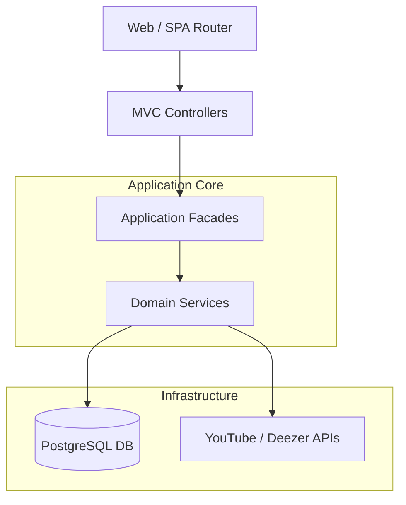

# 🎵 VibeMusic - Premium AI-Powered Music Experience

VibeMusic is a high-performance music streaming application built with **.NET 10** and **ASP.NET Core MVC**. It leverages external APIs (YouTube, Deezer, ITunes) alongside an internal AI processing engine to deliver a seamless, personalized listening experience with real-time metadata bridging and automated data repair.

 <!-- Template link -->

## 🚀 Core Features

- **Dynamic Metadata Bridging**: Automatically fills internal database gaps with fresh data from Deezer and YouTube.
- **AI-Enhanced Discovery**: Personalized sections curated based on listening habits and time of day.
- **Smart Data Healing**: Proactive background tasks that detect and repair inaccurate external metrics.
- **Glassmorphism UI**: A premium, dark-mode focused interface with smooth animations and hidden scrollbars for an "App-like" feel.
- **Real-time Interaction**: Full support for song comments, replies, and play history tracking.

## 🛠 Technology Stack

- **Framework**: ASP.NET Core 10 (Onion Architecture)
- **Database**: PostgreSQL with EF Core 8
- **External Integration**: YouTubeExplode, Deezer API, ITunes Search API
- **AI/LLM**: Semantic Kernel with Google Gemini (Optional)
- **Frontend**: Vanilla JS (ES6+), CSS Modules, Bootstrap 5 (Styling only)

## 📊 System Architecture



## 🏗 Project Structure

- `VibeMusic`: Web UI and Controllers (MVC).
- `VibeMusic.Application`: Business logic, DTOs, and Service interfaces.
- `VibeMusic.Infrastructure`: External API clients and Database implementations.
- `VibeMusic.Domain`: Core entities and repository abstractions.

## ⚙️ Local Setup

1. **Clone the repository**:
   ```bash
   git clone https://github.com/maitieubao/ASM.NET.git
   ```
2. **Database Migration**:
   ```bash
   cd VibeMusic
   dotnet ef database update
   ```
3. **Run the Project**:
   ```bash
   dotnet run
   ```

## 🐞 Debug Checklist

If a song is not playing or metadata looks wrong:
1.  **Check YouTube ID**: Ensure the `YoutubeVideoId` is valid in the `Songs` table.
2.  **Clear Cache**: Refresh browser with `Ctrl + F5` (clears timestamped JS/JSON cache).
3.  **Logs**: Check console for `[AUTO-HEAL]` or `[METADATA-BRIDGE]` triggers.
4.  **Transaction Status**: Verify `uow.CompleteAsync()` was called in the relevant service.

---
Developed by **maitieubao** with ❤️
