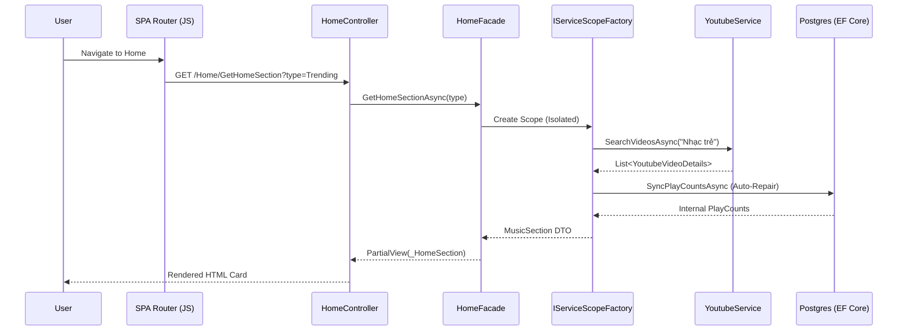

# System Architecture - VibeMusic

This document explains the technical design and architectural patterns used in VibeMusic.

## 🧅 Architectural Layers (Onion Architecture)

VibeMusic follows a strict Clean Architecture (Onion) pattern to ensure high maintainability and testability.

### 1. Domain Layer (`VibeMusic.Domain`)
- **Entities**: Pure C# classes representing the core concepts (`Song`, `Artist`, `Interaction`).
- **Interfaces**: Definitions for repositories and unit of work.
- **Constraints**: This layer has ZERO dependencies on other projects or external libraries.

### 2. Application Layer (`VibeMusic.Application`)
- **DTOs**: Objects used to transport data between layers (`SongDto`, `HomeViewModel`).
- **Interfaces**: Service contracts (`IHomeFacade`, `IPlaybackFacade`).
- **Logic**: Orchestrates domain objects and external services.

### 3. Infrastructure Layer (`VibeMusic.Infrastructure`)
- **Persistence**: EF Core implementation of repositories.
- **External Clients**: Clients for YouTube, Deezer, and iTunes APIs.
- **AI Services**: Integration with Semantic Kernel and Gemini.

### 4. Presentation Layer (`VibeMusic`)
- **Controllers**: Thin MVC controllers handling HTTP requests.
- **Views**: Razor templates integrated with a custom JavaScript SPA router.
- **Resources**: CSS Modules and modular JS logic.

## 🔄 Global Data Flow (System Stream)

## 🛡️ Critical Technical Decisions

### 1. Concurrency & Scope Isolation
To avoid `ObjectDisposedException` and N+1 query traps during parallel loading, we use `IServiceScopeFactory`. Every major parallel block in `HomeFacade` creates its own dedicated `IServiceScope`.

### 2. Transaction Management
We use a **Unit of Work** pattern. Manual transactions are avoided in favor of `CompleteAsync()` to maintain compatibility with Supabase/PostgreSQL connection pooling strategies.

### 3. "Auto-Healing" Strategy
Instead of scheduled cron jobs, VibeMusic uses "On-Access Healing". The moment a song is queried, the system verifies its metrics against sanity thresholds (e.g., >1M playcount reset). This keeps the database consistent without background overhead.
