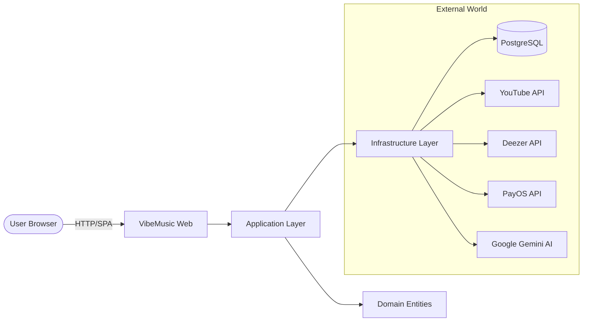

# 📚 VibeMusic Documentation Hub - Master Index

Welcome to the comprehensive technical documentation for the VibeMusic ecosystem. This system is divided into **4 project layers** and **5 functional pillars**.

> [!TIP]
> **New!** Check the **[Feature Showcase Hub](file:///C:/Users/maiti/OneDrive/Desktop/ASM.NET/docs/features/Feature_Index.md)** to see the full list of player, AI, and discovery features.
> **Advanced!** See the **[System Sequence Diagrams](file:///C:/Users/maiti/OneDrive/Desktop/ASM.NET/docs/hub/System_Flows.md)** for visual technical flows.

## 🏗 Project Architecture

| Layer | Project | Responsibility |
| :--- | :--- | :--- |
| **Web** | `VibeMusic` | Controllers, Views (Razor), SPA Router (JS), SignalR Hubs. |
| **Application** | `VibeMusic.Application` | 30+ Service Interfaces, DTOs, and Facade orchestrators. |
| **Infrastructure** | `VibeMusic.Infrastructure` | Database (EF Core), External API Clients (YouTube, Deezer, PayOS, AI). |
| **Domain** | `VibeMusic.Domain` | Core Entities, IUnitOfWork, and Repository interfaces. |

## 🏛 The 5 Pillars of Functionality

Follow these links to explore specific modules:

### 🌟 [Pillar 1: Discovery & Search](file:///C:/Users/maiti/OneDrive/Desktop/ASM.NET/docs/hub/Pillar_1_Discovery.md)
The system's logic for finding music.
- **Includes**: `HomeFacade`, `SearchFacade`, `RecommendationService`.
- **Key Logic**: Blending results from Search API and internal database.

### 🤖 [Pillar 2: AI & Intelligence](file:///C:/Users/maiti/OneDrive/Desktop/ASM.NET/docs/hub/Module_AI_Intelligence.md)
The brain of the application.
- **Includes**: `AiChatService`, `GoogleAiService`, `SemanticKernel`.
- **Key Logic**: AI Plugins for Wikipedia, Music Player command execution, and Chat context.

### 💸 [Pillar 3: FinTech & Monetization](file:///C:/Users/maiti/OneDrive/Desktop/ASM.NET/docs/hub/Module_FinTech.md)
Revenue and Growth logic.
- **Includes**: `PayOSService`, `SubscriptionService`, `ArtistVerificationService`.
- **Key Logic**: Payment webhooks, Subscription renewals, and Verified artist badges.

### 🎵 [Pillar 4: Streaming & Sync](file:///C:/Users/maiti/OneDrive/Desktop/ASM.NET/docs/hub/Module_Streaming_Sync.md)
Core music engine.
- **Includes**: `PlaybackFacade`, `YoutubeService`, `DeezerService`, `ViewCountSync`.
- **Key Logic**: Stream URL generation, metadata bridging, and play count auto-repair.

### ⛓️ [Pillar 5: Operations & Queue](file:///C:/Users/maiti/OneDrive/Desktop/ASM.NET/docs/hub/Module_Operations.md)
Reliability and background work.
- **Includes**: `BackgroundQueue`, `MetadataEnrichmentService`, `NotificationService`.
- **Key Logic**: Asynchronous enrichment of imported videos and system-wide notifications.

---

## 🛠️ Global Dependency Graph

