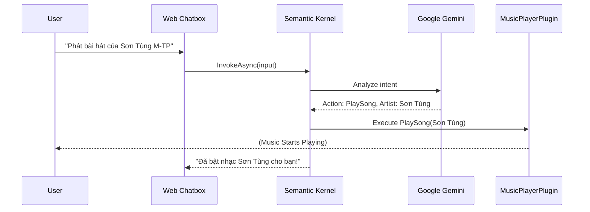

# Module: AI & Intelligence - VibeMusic Brain

VibeMusic integrates cutting-edge Generative AI to provide a Conversational Music Assistant. This is powered by **Microsoft Semantic Kernel** and **Google Gemini 1.5 Pro**.

## 🧠 Core Components

### 1. Google AI Service (`GoogleAiService.cs`)
- Handles direct communication with Google's LLM APIs.
- Manages token usage and safety filters for user queries.

### 2. Semantic Kernel Orchestrator (`AiChatService.cs`)
The "Heart" of the chatbot. It coordinates:
- **Planner**: Determines which "Plugin" to call based on user intent.
- **Connectors**: Bridges the LLM with VibeMusic's internal services.
- **Memory**: Stores recent conversation history for context-aware responses.

## 🔌 Custom AI Plugins

Semantic Kernel uses Plugins to give the AI "Arms and Legs":

| Plugin | Purpose | Functionality |
| :--- | :--- | :--- |
| **MusicPlayerPlugin** | Controls playback | `PlaySong`, `NextTrack`, `Mute`, `ChangeVolume`. |
| **WikipediaPlugin** | External Knowledge | Fetches artist biographies and trivia from Wikipedia. |
| **UserInteractionPlugin**| Social Actions | Submits comments or likes songs on behalf of the user. |

## 🔄 AI Request Flow

## 🛠️ Internal Anatomy (The Middleware)

Beyond the high-level services, the AI module contains specialized middleware to handle LLM quirks:

| Component | Responsibility |
| :--- | :--- |
| **KernelFactory.cs** | The central configuration point for Semantic Kernel. It registers Google Gemini connectors and manages dependency injection for all AI plugins. |
| **PromptBuilder.cs** | Handles dynamic prompt assembly. It injects User IDs, recent history, and personality instructions before sending requests to the LLM. |
| **ActionExtractor.cs** | A parsing engine that converts LLM text outputs into system actions (e.g., extracting the ID `X` from `ACTION:play:X`). |
| **RetryHandler.cs** | A critical resilience component. It handles `429 Too Many Requests` errors from providers like Groq by implementing an exponential backoff strategy. |
| **AiUserAccessGuard** | A security layer that ensures the AI never performs actions (like deleting a playlist) on behalf of one user for another user's data. |
