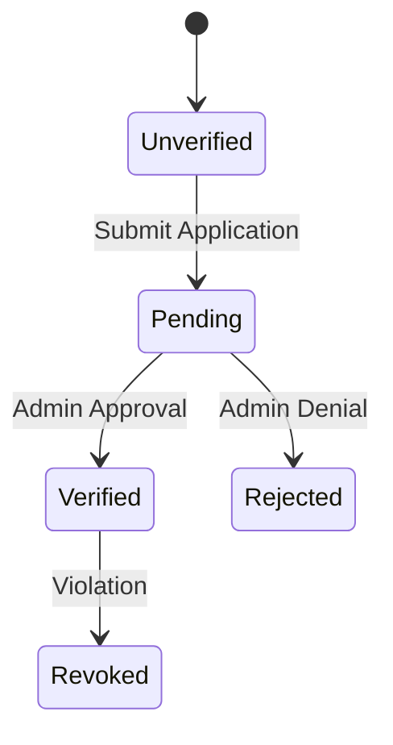

# Module: FinTech & Monetization - VibeMusic Revenue

VibeMusic includes a robust financial system for premium subscriptions and artist verified statuses.

## 💳 Payment Gateway: PayOS

We integrate with **PayOS**, a modern Vietnamese payment gateway.

### Integration Flow:
1.  **Checkout Generation**: `PayOSService.CreatePaymentLinkAsync` generates a secure payment URL.
2.  **User Payment**: User is redirected to PayOS to pay via bank transfer or QR code.
3.  **Webhook Notification**: PayOS sends an HTTP POST to our `/Subscription/Webhook` endpoint.
4.  **Verification**: We verify the signature and update the `Subscription` status in `AppDbContext`.

## 💎 Subscription Tiers

Managed by `SubscriptionService.cs`:
- **1 Month**: Standard premium access.
- **1 Year**: Discounted annual plan.
- **Lifetime**: Permanent access using `DateTime.MaxValue` as expiry.

### Business Rule: Expiry Notification
If a subscription is within 3 days of expiring, `NotificationService` triggered by `BackgroundQueue` sends a push alert to the user.

## ✅ Artist Verification System

Managed by `ArtistVerificationService.cs`.
- **System**: Artists can apply for a "Verified Badge".
- **Workflow**:
    1.  User submits social links (YouTube channel ID, Spotify link).
    2.  Admin reviews via the `AdminDashboard`.
    3.  On approval, `IsVerified=true` is set on the `Artist` entity.

## 🏦 Technical Implementation

- **Service**: `PayOSService` (Infrastructure Layer).
- **Endpoint**: `Controllers/SubscriptionController.cs`.
- **Logic**: Uses `IUnitOfWork` for transactional integrity during payment processing.
