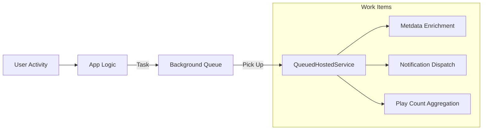

# Module: Operations & Background Tasks - VibeMusic Backbone

VibeMusic uses a non-blocking architecture to handle heavy tasks (Metadata scraping, Notifications) without slowing down the user experience.

## 📥 Background Message Queue

We use a custom `BackgroundQueue` service based on `Channel<T>` for high-throughput, low-latency task processing.

### Task Journey:
1.  **Request**: In `HomeController`, a user imports a new song.
2.  **Enqueue**: The `BackgroundQueue.QueueBackgroundWorkItemAsync` is called immediately.
3.  **Process**: The `QueuedHostedService` (BackgroundWorker) picks up the task and executes the long-running logic.

## 🧪 Metadata Enrichment Service

`SongMetadataEnrichmentService` runs in the background to improve imported song data.
- **Workflow**:
    1.  Downloads the high-res thumbnail.
    2.  Fetches hashtags from the YouTube description.
    3.  Queries WikiService for artist background.
    4.  Tags the track type (Official, Remix, Live).

## 🔔 Notification System

The `NotificationService` manages system alerts and user-specific messages.
- **Types**:
    - `SubscriptionExpiring`: Sent via background worker 3 days before expiry.
    - `NewCommentReply`: Real-time notification when a user replies to a comment.
    - `SystemAnnouncement`: Global banner for all users.

## 🏗️ Technical Details
- **Pattern**: Producer-Consumer pattern using `System.Threading.Channels`.
- **Infrastructure**: Registered as a `HostedService` in `Program.cs`.
- **Durability**: Tasks are in-memory (Short-term), ensuring fast response times.
