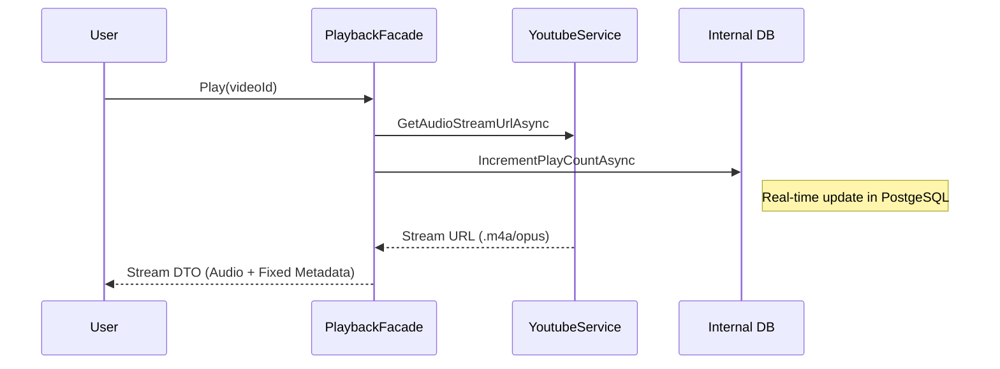

# Module: Streaming & Synchronization - VibeMusic Engine

The Streaming engine is the most data-intensive module, handling real-time audio extraction and metadata harmonization.

## 📡 External Provider Aggregation

VibeMusic does not host audio. It acts as an aggregator for:
- **YouTube (Audio Source)**: Source for the physical `.opus` / `.m4a` streams via `YoutubeExplode`.
- **Deezer (Metadata Provider)**: Official Source for track titles, artist names, and album art.
- **iTunes (Catalog)**: Secondary source for finding high-quality album metadata.

## 🌉 The "Metadata Bridge" Strategy

To solve the "YouTube Garbage Data" problem (e.g., Artist="Music", Title="Sơn Tùng - DLTTAD (Official MV)"), we use a bridging logic:

1.  **Extract YT ID**: Retrieve the raw video ID.
2.  **External Search**: Use the YT title to find the "Official" version on Deezer.
3.  **Overwrite**: If Deezer metadata is found, we replace the YouTube metadata with canonical values provided by Deezer.

## 🏥 View Count & Play Count Synchronization

We distinguish between **Lượt xem (Views)** from YouTube and **Lượt nghe (Plays)** from our system.

### Data Repair (Auto-Healing)
The system has a built-in safety net against "YouTube Data Leaks":
- **Issue**: Historical imports accidentally copied YouTube's 100M+ view counts into the internal DB.
- **Fix**: The `HomeFacade` and `GetSongPlayCountAsync` methods check for values > 1,000,000.
- **Automatic Action**: Detected leaks are reset to `0` and saved to the Database on-access.

## 🚀 Streaming Flow

## ⚙️ Low-Level Media Architecture

The system uses a decoupling strategy for YouTube interaction to remain resilient to API changes and scraping limits.

| Component | Responsibility |
| :--- | :--- |
| **YoutubeApiClient**| Provides direct access to the YouTube Data API for search, channel videos, and trending music. |
| **YoutubeStreamResol**| The core "Scraper" engine using `YoutubeExplode`. It bypasses the standard API to find direct audio stream URLs. |
| **TrackMetadataProc**| A specialized string processor. It removes garbage tags (e.g., "[OFFICIAL MV]", "HD", "4K") from YouTube titles to clean up the UI. |
| **VideoEnrichmentSvc**| Orchestrates the "Deep Search" logic — if a YouTube video lacks metadata, this service queries Deezer/iTunes to find the correct album art and artist. |
