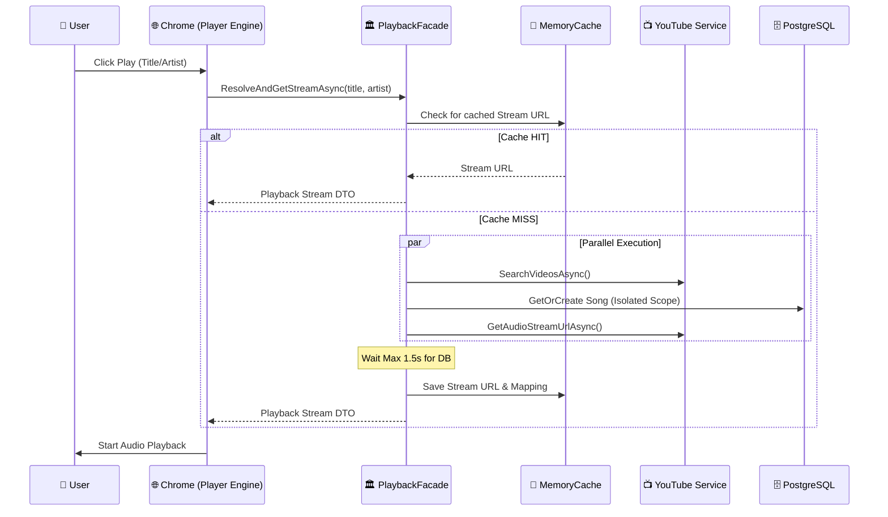
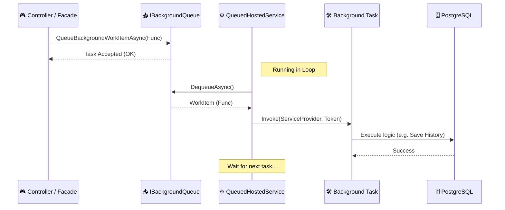
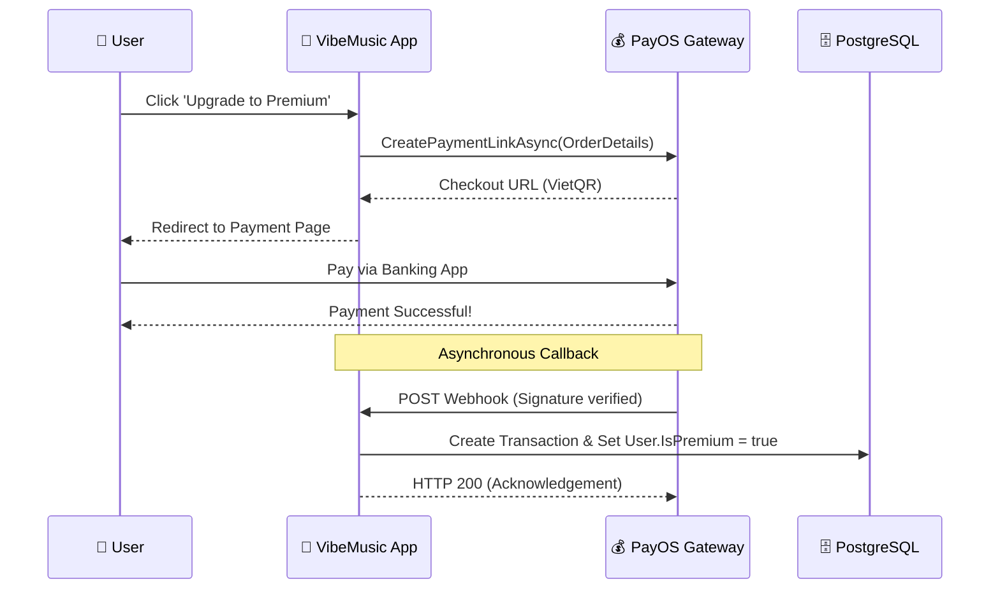
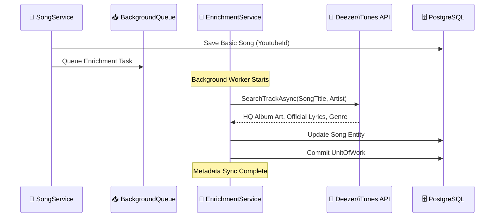

# 🌊 VibeMusic System Sequence Diagrams

This document visualizes the internal logic of critical system operations. These diagrams explain the coordination between the Frontend, the C# Application Layer, and External Providers.

---

## 1. Luồng Giải quyết Phát nhạc (Playback Resolution)
This flow handles searching, metadata matching, and audio stream extraction within a strict 1.5s timeout.

---

## 2. Luồng Tác vụ ngầm (Background Queue)
How VibeMusic offloads heavy tasks (History, Notifications) to keep the UI responsive.

---

## 3. Luồng Thanh toán Premium (PayOS Lifecycle)
The secure path from upgrading to automatic role assignment.

---

## 4. Luồng Tự động làm giàu dữ liệu (Auto-Saving & Enrichment)
Bridging sparse YouTube data to high-quality music metadata.

